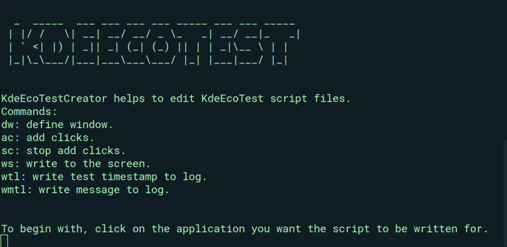

# KdeEcoTest | KdeEcoTestCreator


`KdeEcoTest` and `KdeEcoTestCreator` are python based tools designed for reproducing computer actions by simulating keyboard and mouse acitivity.

Contents
========
* [Why?](#why)
* [Installation](#installation)
* [Usage](#usage)
* [Want to contribute?](#want-to-contribute)

### Why?
A Standard Usage Scenario reflects the typical functions of an application and is central to measuring the energy consumption of software.
`KdeEcoTest` helps to create a script which simulates the task of a normal user do in order to create standard usage scenario and also run those scirpts to automate the scenario and helps to measure energy consumption of that application.

KdeEcoTest is a cross-platform and CLI based python tool which is built using xdotool.

### Installation
> In order to run KdeEcoTest , These modules are required to be installed on your device.

```bash
$ pip3 install python-libxdo
$ pip3 install pynput
```

```bash
# Debian/Ubuntu
$ sudo apt-get install xdotool
$ sudo apt install python3-tk

# Arch
$ sudo pacman -S xdotool
$ sudo pacman -S tk

# Fedora
$ sudo dnf install xdotool
$ sudo dnf install tk
$ sudo dnf install python3-tkinter

# <your distro>
# install xdotool
# install tk
```

### Usage

#### Clone & Setup the virtual environment

```bash
$ git clone https://invent.kde.org/teams/eco/feep.git
$ cd feep/tools/KdeEcoTest/
$ pip install pipenv
$ pipenv install
$ pipenv shell
```

#### Create new script 

```bash
$ python3 KdeEcoTest.py create --script KdeEcoTestScript.txt
```
- To abort the program : Press Esc
- A round mouse pointer appears, Click on the window you want to test.Now, You can use these options provided by KdeEcoTest to simulate actions and create a test script.

```shell
Commands:
dw: define window.
ac: add clicks.
sc: stop add clicks.
ws: write to the screen.
wtl: write test timestamp to log.
wmtl: write message to log.
```

#### Run a script
KdeEcoTest automates the actions stored in the created scripts created.
- To run KdeEcoTest script :
```bash
$ python3 KdeEcoTest.py run --script KdeEcoTestScript.txt
```
- To abort the program : Press Esc

### Want to contribute?
> Before contributing, fork the repository and make a MR when you fix the issue.

Contribute in the following ways:

#### To-Do's
- Modal window : KdeEcoTest doesn't record the clicks on modal window.We need to find a way to add it.

- Keyboard Activity : Curently KdeEcoTest only capture mouse activity with typing text as the only keyboard activity. We want to record keyboard controls too,Find a way to add keyboard activity.

- Documentation : You can always improve the documentation making it more easier for people to use this tool and contribute to it.

Ask Questions at : [KDE-Energy Efficency Matrix](https://matrix.to/#/#energy-efficiency:kde.org)
